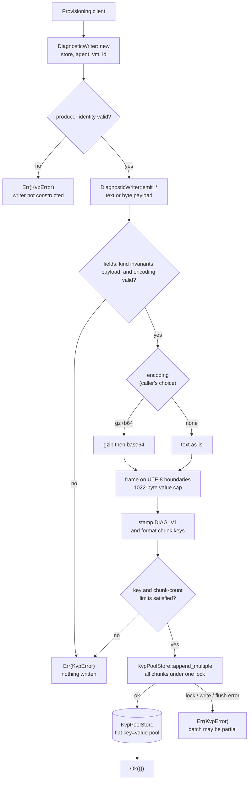
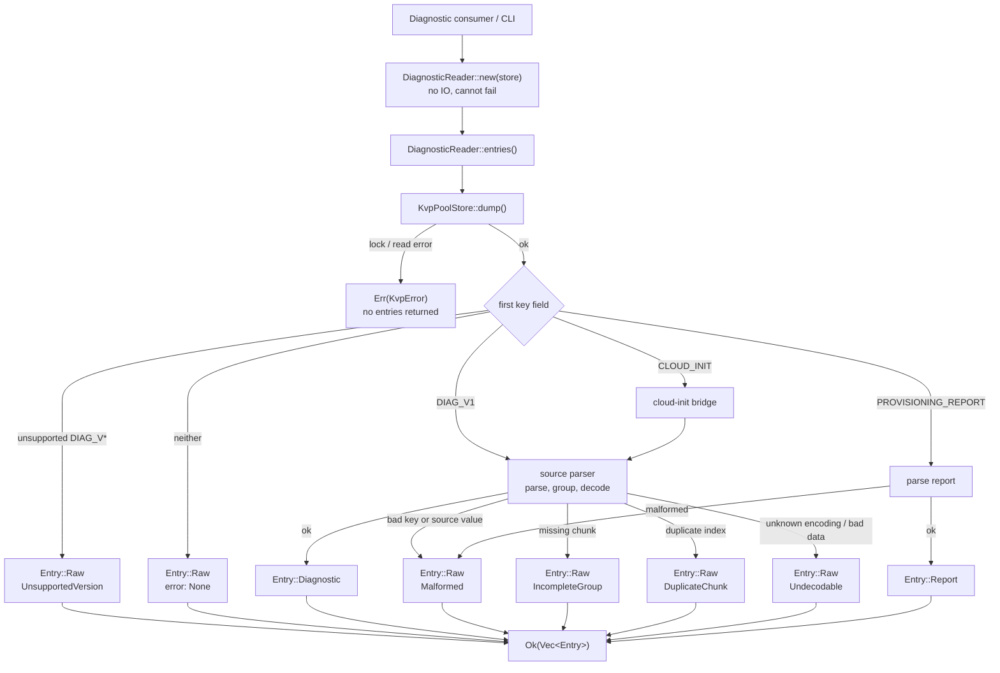

# KVP Diagnostics Specification

## Background

Diagnostics are the records a provisioning client emits to explain what a boot did: spans that mark when an operation such as `provision:run` starts and finishes, and point observations that capture a single event or artifact, such as an IMDS result or a `dmesg` snapshot. They let an operator or the host reconstruct a boot and triage a failure after the fact, including when the guest is no longer reachable.

A Hyper-V guest carries these records to the host through a KVP pool: a flat namespace of key=value records that the host copies out of the running guest. We already have `KvpPoolStore`, which gives raw, in-order access to that pool but no notion of diagnostics.

The pool constrains the design in four ways:

- A record is a flat key=value pair. The key is the only structured metadata; the value is opaque bytes to the pool.
- Keys and values are size-capped. The safe key limit is 254 bytes and the safe value limit is 1022 bytes, so a message larger than the value limit cannot fit in one record and must span several records that share a key and differ only by a trailing index.
- The host may copy or truncate the pool at any moment. A reader can find a group whose members are missing, duplicated, or out of order.
- There is no native grouping or typing. A diagnostic event exists only as a convention encoded in the key and the value.

This spec defines a next-generation diagnostics format for a provisioning client (azure-init), the writer that produces it, and the reader that interprets the pool. cloud-init also writes diagnostics into the same pool in its own format; reading those is a separate read-only concern (see Compatibility).

### Records today

Both producers already write diagnostics into the pool, in two different shapes.

azure-init uses a pipe-delimited key with a plain-text value and no encoding field. The `type` token is `start`, `finish`, or `event`; a value over the size limit is split with a trailing chunk index:

```text
<agent>|<boot_epoch>|<vm_id>|<type>|<name>|<event_id>|<timestamp>|<chunk_index>

# point event, one record
azure-init-0.1.1|1700000000|vm-abc|event|imds|8f3e9c4a-1b2c-4d5e-9f01-234567890abc|2026-07-27T21:33:24.300Z|0
  value: Retrieved 1 key from IMDS

# span start
azure-init-0.1.1|1700000000|vm-abc|start|provision:run|9c1d2e3f-4a5b-6c7d-8e9f-0a1b2c3d4e5f|2026-08-31T12:34:56.789Z|0
  value: starting

# span finish, same event_id as its start
azure-init-0.1.1|1700000000|vm-abc|finish|provision:run|9c1d2e3f-4a5b-6c7d-8e9f-0a1b2c3d4e5f|2026-08-31T12:34:57.101Z|0
  value: provisioning succeeded

# long value split across records, one event_id, indices 0..N
azure-init-0.1.1|1700000000|vm-abc|event|config:dump|1a2b3c4d-5e6f-7a8b-9c0d-1e2f3a4b5c6d|<ts>|0   value: <chunk 0>
azure-init-0.1.1|1700000000|vm-abc|event|config:dump|1a2b3c4d-5e6f-7a8b-9c0d-1e2f3a4b5c6d|<ts>|1   value: <chunk 1>
```

cloud-init puts the type and name before the identifiers; a current key carries a `vm_id` that an older key omits. The value is JSON with `ts` and `msg`, `result` and `duration` on a finish, `msg_i` per chunk on a split value, and an `{encoding, data}` envelope inside `msg` when compressed:

```text
current  CLOUD_INIT|<incarnation>|<type>|<name>|<vm_id>|<event_id>[|<chunk_index>]
older    CLOUD_INIT|<incarnation>|<type>|<name>|<event_id>[|<chunk_index>]

# span finish with result and duration (current key)
CLOUD_INIT|1785187982|finish|modules-final/config-scripts_user|0e5e179d-5341-478b-8456-fbb90621bdf8|e5f01809-a7a3-4279-aa64-1f18e21eda6e
  value: {"name":"modules-final/config-scripts_user","type":"finish","ts":"2026-07-27T21:33:24.339006+00:00","result":"SUCCESS","duration":0.00064,"msg":"config-scripts_user ran successfully and took 0.001 seconds"}
  msg -> "config-scripts_user ran successfully and took 0.001 seconds"

# span start, no result or duration
CLOUD_INIT|1785187982|start|modules-final/config-ssh_authkey_fingerprints|0e5e179d-5341-478b-8456-fbb90621bdf8|c4d4a08d-fe93-4c7a-9be6-9a38c212e212
  value: {"name":"modules-final/config-ssh_authkey_fingerprints","type":"start","ts":"2026-07-27T21:33:24.339170+00:00","msg":"running config-ssh_authkey_fingerprints with frequency once-per-instance"}
  msg -> "running config-ssh_authkey_fingerprints with frequency once-per-instance"

# older key without vm_id (five base fields)
CLOUD_INIT|1785187982|finish|modules-final|126f969f-13fd-4b4b-a136-b7114518491f
  value: {"name":"modules-final","type":"finish","ts":"2026-07-27T21:33:24.431885+00:00","result":"SUCCESS","duration":0.340712044,"msg":"running modules for final"}
  msg -> "running modules for final"

# point event
CLOUD_INIT|1785187982|event|network-config|0e5e179d-5341-478b-8456-fbb90621bdf8|a1b2c3d4-e5f6-7a8b-9c0d-1e2f3a4b5c6d
  value: {"name":"network-config","type":"event","ts":"2026-07-27T21:33:20.100000+00:00","msg":"applied fallback network configuration"}
  msg -> "applied fallback network configuration"

# system-info (not a timeline position; the subject is in name)
CLOUD_INIT|1785187982|system-info|system information|0e5e179d-5341-478b-8456-fbb90621bdf8|b2c3d4e5-f6a7-8b9c-0d1e-2f3a4b5c6d7e
  value: {"name":"system information","type":"system-info","ts":"2026-07-27T21:33:19.500000+00:00","msg":"cloud-init running on Ubuntu"}
  msg -> "cloud-init running on Ubuntu"

# split value: each chunk carries msg_i, and a JSON \n escape is split across the boundary
CLOUD_INIT|1785187982|finish|modules-final|0e5e179d-5341-478b-8456-fbb90621bdf8|c3d4e5f6-a7b8-9c0d-1e2f-3a4b5c6d7e8f|0
  value: {"name":"modules-final","type":"finish","ts":"2026-07-27T21:33:24.43Z","msg_i":0,"msg":"line1\"}
CLOUD_INIT|1785187982|finish|modules-final|0e5e179d-5341-478b-8456-fbb90621bdf8|c3d4e5f6-a7b8-9c0d-1e2f-3a4b5c6d7e8f|1
  value: {"name":"modules-final","type":"finish","ts":"2026-07-27T21:33:24.43Z","msg_i":1,"msg":"nline2"}
  msg -> "line1\nline2" (reassembled from the two chunks)

# compressed artifact: type=compressed, msg holds an {encoding, data} envelope; a large one splits like the value above
CLOUD_INIT|1785187982|compressed|dmesg|0e5e179d-5341-478b-8456-fbb90621bdf8|d4e5f6a7-b8c9-0d1e-2f3a-4b5c6d7e8f90|0
  value: {"name":"dmesg","type":"compressed","ts":"2026-07-27T21:33:25.00Z","msg_i":0,"msg":"{\"encoding\":\"gz+b64\",\"data\":\"H4sIAAAA...\"}"}
  msg -> {"encoding":"gz+b64","data":"H4sIAAAA..."}
```

The two disagree on field order, on where the timestamp and encoding live, and on whether the value is text or JSON.

## Proposed design

This proposal defines one versioned diagnostic record format, emitted here by azure-init, and separate reader and writer interfaces over `KvpPoolStore`. The reader interprets the pool; the writer produces only this format. Untyped access remains on `KvpPoolStore` itself.

### Diagnostics format

The proposed key is the current azure-init key with a few changes, all keeping metadata in the key. It is pipe-delimited with `|` reserved, begins with a diagnostic schema-version identifier, and always ends with the chunk index, so a single-record value still ends in `|0`:

```text
DIAG_V1|<agent>|<vm_id>|<kind>|<name>|<event_id>|<timestamp>|<encoding>|<result>|<duration>|<chunk_index>
```

- `DIAG_V1` is the `diagnostic_version_id`: `DIAG` identifies the general diagnostics family and `V1` identifies version 1 of its wire schema. It does not identify the producer; `agent` continues to do that. The schema covers the field layout, required and optional fields, token meanings, units, encoding rules, and chunk framing. It is one self-identifying token rather than a bare number because the pool also contains unrelated keys: a reader can recognize an unsupported future `DIAG_V*` record without mistaking an arbitrary numeric key for a diagnostic. A schema change requires a new `diagnostic_version_id`; an agent release by itself does not.
- The previous `boot_epoch` field is removed. Each diagnostic already carries an absolute timestamp, while stale-pool cleanup owns removal of records from prior boots; the schema does not duplicate that boot identity.
- `type` becomes `kind`, narrowed to the three timeline positions (`start`/`finish`/`event`); any other category is carried by `name`, `encoding`, or `result`, not a token.
- `encoding` names the payload encoding in the key so a large artifact can be compressed.
- `result` and `duration` are the finish's verdict fields, carried in the key: `result` is a `success`/`fail` token and `duration` is the elapsed milliseconds. Both are required on a finish, optional on an event, and empty on a start. Everything else, including the plain-text value, is unchanged.

| Field | Meaning |
|---|---|
| diagnostic_version_id | `DIAG_V1`; identifies the wire schema and selects its parser before any later field is interpreted |
| agent | Producer identifier, such as `azure-init-0.1.1` |
| vm_id | VM identity |
| kind | `start` or `finish` for a span, `event` for a point observation |
| name | Subject, such as `provision:run` or `dmesg` |
| event_id | Shared by a span's start and finish, and by every chunk of one value |
| timestamp | RFC 3339 (ISO 8601), UTC with a `Z` suffix, millisecond precision, e.g. `2026-08-31T12:34:56.789Z` |
| encoding | How the value is encoded: `none` or `gz+b64` |
| result | `success` or `fail` on a finish, optionally on an event; empty otherwise |
| duration | Elapsed milliseconds on a finish, optionally on a timed event; empty otherwise |
| chunk_index | Chunk position, from 0 |

#### Key size

The whole key is one string, and the host silently truncates a guest-written key past 254 UTF-8 bytes; safe-mode `KvpPoolStore` rejects it first. The fixed fields spend most of that budget: `vm_id` and `event_id` at 36 bytes each plus the 24-byte `timestamp` are already 96 bytes, and `DIAG_V1` adds another 7 before the enums, numbers, and delimiters. A representative finish key runs about 173 bytes, leaving roughly 81 before the limit.

Only `agent` and `name` are free-form; every other field is bounded by its format or its enum. The writer caps the two so the whole key cannot exceed 254 bytes:

| Field | Cap | Bounded by |
|---|---|---|
| diagnostic_version_id | 7 B | fixed `DIAG_V1` token |
| agent | 32 B | free-form producer id |
| name | 48 B | free-form subject |
| vm_id, event_id | 36 B each | GUID / UUID |
| timestamp | 24 B | fixed format |
| duration | 10 B | digits |
| result, encoding, kind | ≤ 7 B each | enum token |
| chunk_index | 4 B | at most 1023 records |

With those caps the worst-case key is 226 bytes, leaving 28 bytes inside the limit. cloud-init reads are never capped; the bridge takes names as they are.

### Kinds

`kind` marks where a record sits in an operation's timeline, and only that: `start` opens a timed operation, `finish` closes one, and `event` is a one-off that opens and closes nothing. Those three cover every position. A would-be fourth kind is really something the key already records: how the bytes are packed (`encoding`), what the record is about (`name`), or how it turned out (`result`). No kind carries a structured payload; the value is always a plain message or an artifact read per `encoding`.

For a concrete case, cloud-init's `type` field carries `compressed` and `system-info` tokens beside the same three. Neither is a timeline position: `compressed` is how the bytes are packed, an `encoding` here, and `system-info` is a subject, a `name`. How cloud-init's tokens map onto these three is in Compatibility.

#### start

A `start` opens a span, an operation that takes measurable time such as `provision:run`. Its `timestamp` marks when the operation began, and its value is a short opening message.

It shares one `event_id` with its `finish`; that shared id is what ties the pair, so a `start` whose `finish` never arrives stands out as an operation that began but never ended, exactly the signal an operator wants after a hang or crash.

```text
DIAG_V1|azure-init-0.1.1|vm-abc|start|provision:run|9c1d2e3f-...|2026-08-31T12:34:56.789Z|none|||0   value: starting
```

#### finish

A `finish` closes the span it shares an `event_id` with. Its `timestamp` is later than the start's, and it reports the operation's outcome directly in the key: `result` is `success` or `fail`, and `duration` is the elapsed milliseconds. The writer holds the start instant, so it stamps `duration` at emit time rather than making a reader pair the two records to recover it, and a truncated pool that kept only the finish still carries both the verdict and the elapsed time. The value stays a human message such as `provisioning succeeded` or `provisioning failed: <reason>`. cloud-init carries the same fields in its value JSON, which the bridge maps across (see Compatibility).

```text
DIAG_V1|azure-init-0.1.1|vm-abc|finish|provision:run|9c1d2e3f-...|2026-08-31T12:34:57.101Z|none|success|312|0   value: provisioning succeeded
```

#### event

An `event` is a point observation with no open or close: a single fact captured at one moment, such as an IMDS result or a `dmesg` snapshot. It has its own `event_id`, with no start or finish to pair. Most diagnostics are events.

Its value is the observed payload, read per `encoding`: a short text as `none`, or a large artifact the caller marks for compression as `gz+b64`, split across chunks that share the `event_id` and differ only by `chunk_index`. An event may also set `result` (`success`/`fail`) when the observation is itself a pass or failure, and `duration` when it measured how long something took with no start and finish to bracket it; it leaves either empty when it does not apply.

```text
# plain text, one record
DIAG_V1|azure-init-0.1.1|vm-abc|event|imds|8f3e...|2026-07-27T21:33:24.300Z|none|||0   value: Retrieved 1 key from IMDS

# an event that is itself a failure sets result
DIAG_V1|azure-init-0.1.1|vm-abc|event|imds|7b2c...|2026-07-27T21:33:24.400Z|none|fail||0   value: IMDS unreachable

# a self-contained timing sets duration but no result
DIAG_V1|azure-init-0.1.1|vm-abc|event|imds:probe|5d6e...|2026-07-27T21:33:24.500Z|none||52|0   value: probed IMDS in 52ms

# compressed artifact, split across records, indices 0..N
DIAG_V1|azure-init-0.1.1|vm-abc|event|dmesg|9a1b...|<ts>|gz+b64|||0   value: <base64 of gzip, chunk 0>
DIAG_V1|azure-init-0.1.1|vm-abc|event|dmesg|9a1b...|<ts>|gz+b64|||1   value: <chunk 1>
```

### Payloads

The public API distinguishes text from arbitrary bytes instead of representing every decoded payload as `Vec<u8>`. `DiagnosticPayload::Text` carries a Rust `String`, which is already valid UTF-8; `DiagnosticPayload::Bytes` carries arbitrary bytes. Writer methods accept `impl Into<DiagnosticPayload>`, with conversions from `&str`, `String`, `&[u8]`, and `Vec<u8>`, so callers can pass either form without separate method names.

The caller still chooses the wire `encoding`; the input type does not guess whether compression is useful. The writer handles each combination as follows:

| Input | `encoding=None` | `gz+b64` |
|---|---|---|
| Text | Store its UTF-8 bytes directly | Encode its UTF-8 bytes |
| Bytes | Validate UTF-8, then store directly; reject invalid UTF-8 | Encode the arbitrary bytes |

On read, `none` must decode as UTF-8 and produces `DiagnosticPayload::Text`; invalid UTF-8 is `Undecodable`. `gz+b64` produces `DiagnosticPayload::Bytes` after decoding, even when those bytes happen to be valid UTF-8, because the wire schema does not declare their content type.

In JSON output, `Text` is a JSON string. `Bytes` is `{ "type": "bytes", "encoding": "base64", "data": "..." }`, because JSON cannot carry arbitrary bytes; this presentation encoding does not change the diagnostic's wire `encoding`.

### Encodings

`encoding` names how the payload is represented in the KVP value, chosen by the caller when it emits a diagnostic rather than guessed from size, so the choice is deterministic. It lives in the key so a reader knows it without parsing the value, and the value stays a single opaque payload rather than a wrapper. Arbitrary binary uses `gz+b64` because the store holds values as UTF-8 and trims trailing nulls, so raw bytes would not survive a round trip. `DIAG_V1` does not define standalone base64; a later schema can add another encoding without changing the key's overall shape. cloud-init instead declares its encoding inside the value (see Compatibility).

Whatever the encoding, a value over the 1022-byte limit is split across chunks that share the value's `event_id` and `kind` and are ordered by `chunk_index`; decoding joins them in order before anything else.

#### none

Plain UTF-8 text, the default and the common case. The value is the message as stored, so decoding is a no-op; a split value is just the text slices joined in index order. Span messages and short observations use `none`.

#### gz+b64

base64 of gzip of the raw payload bytes, for a large compressible artifact such as `dmesg`. Writing gzips the payload, base64-encodes the result, then chunks it; decoding joins the chunks, base64-decodes, and gunzips. It is one gzip stream spread across the chunks, so a missing chunk makes the whole artifact unavailable: a visible index gap is `IncompleteGroup`, while a contiguous truncation is detected during decoding as `Undecodable`. That is the cost it trades for far fewer records.

### Reads and writes

A pool holds many diagnostics. Each is a start, finish, or event, and each is stored as one or more chunks (`chunk_index` 0 to N):

```text
Diagnostics pool
├─ start   provision:run
│  └─ chunk 0
├─ event   imds
│  └─ chunk 0
├─ event   dmesg  (gz+b64, 3 chunks)
│  ├─ chunk 0
│  ├─ chunk 1
│  └─ chunk 2
└─ finish  provision:run
   └─ chunk 0
```

`DiagnosticReader::entries()` reads the pool once and interprets every record, returning one `Entry` each: it combines and decodes a diagnostic into a `Diagnostic`, parses the `PROVISIONING_REPORT` into a `ProvisioningReport`, and leaves anything else as `Raw` (its key and value). A recognized record that will not parse — a broken diagnostic group, an unsupported diagnostics version, or a malformed report — also falls back to `Raw`, carrying the `DecodeError`, so nothing is dropped. A caller that wants the untouched records reads `KvpPoolStore` directly.

Writing is the inverse: `DiagnosticWriter` stamps `DIAG_V1`, converts the typed payload according to `encoding`, frames it into records, and appends them to the `KvpPoolStore`.

Reading the pool like a log is the `Diagnostic` entries in timestamp order. The host may reorder the pool, so a reader sorts on the timestamp each carries. Text output renders each as one line:

```text
2026-08-31T12:34:56.789Z  start   provision:run
2026-08-31T12:34:57.020Z  event   imds            ok
2026-08-31T12:34:57.101Z  finish  provision:run   success   312ms
```

Splitting the type by kind is what keeps each line honest: a `finish` always carries its `result` and `duration`, a `start` carries neither, and an `event` carries either when the caller measured it, so the renderer never second-guesses an optional field. An operation that began but never finished is a `Start` with no matching `Finish`, still printed in place, which is the signal an operator wants after a crash:

```text
2026-08-31T12:35:10.000Z  start   provision:run
(no finish)
```

A finished operation already carries its `duration` on its finish line, so there is nothing to roll up. Pairing a start to its finish is a plain group-by on `event_id` when a reader wants both ends at once, and a start with no matching finish is an operation that began but never ended.

Write:



Read (`DiagnosticReader::entries()`):



`KvpError` and `DecodeError` mark different boundaries. A `KvpError` means the requested construction, read, or write could not complete and is returned by the method. A `DecodeError` means the pool read succeeded but stored data could not be interpreted; `entries()` still succeeds and preserves that data as `Entry::Raw` with the reason.

The writer prepares and validates the complete batch before calling the store, so an identity, field, payload, encoding, or size error writes nothing. This includes byte input that is not valid UTF-8 when `encoding=None`. Once `append_multiple` begins, a lock, write, or flush error returns `KvpError` but may leave part of the batch in the pool. A reader reports a visible index gap as `IncompleteGroup` and invalid encoded content as `Undecodable`. A contiguous prefix of a `none` payload has neither condition and cannot be distinguished from a complete value because this format carries no total chunk count.

The `diagnostic_version_id` is part of every diagnostic group key, so chunks from different schemas can never combine. The rest of the group key includes `kind` because a span's start and finish share an `event_id`. There is no decode-time size limit either: the producer is trusted and the pool bounds the input, so an artifact either fits when it is written or is never written.

## Crate design

The crate exposes two interfaces over `KvpPoolStore`; neither holds files or locks, and both delegate all IO to the store. `DiagnosticWriter` is the provisioning clients' producer interface: clients provide diagnostic meaning and payload, but do not construct keys, frame chunks, or append diagnostic records directly. A diagnostic consumer reads through `DiagnosticReader`; a caller that wants untyped records uses the store directly. The writer produces azure-init records only. The reader understands supported diagnostics versions and reads cloud-init through the bridge. The format and behavior are in Proposed design; the types, API, and CLI are here.

Their initialization is deliberately asymmetric. `DiagnosticReader` needs only a store because every source, identity, and format decision comes from the records it reads. `DiagnosticWriter` also needs the local `agent` and `vm_id` and validates that stable producer identity once. Neither constructor reads the pool or resolves boot state. The writer always writes the crate's current `DIAG_V1` format; callers cannot select a version or ask it to write cloud-init records. A process that needs both interfaces constructs them from clones of the same `KvpPoolStore`.

```rust
const DIAGNOSTIC_VERSION_ID: &str = "DIAG_V1";

enum Kind { Start, Finish, Event }

/// Plain text is `None`; a compressed value is `GzB64`.
/// `Other` keeps an unknown token so it decodes to `Undecodable`, never a panic.
enum Encoding { GzB64, Other(String) }

enum Outcome { Success, Failure }

/// The decoded payload. Rust strings guarantee UTF-8; bytes make no text claim.
/// `From` implementations map `&str` and `String` to `Text`, and `&[u8]`
/// and `Vec<u8>` to `Bytes`.
enum DiagnosticPayload {
    Text(String),
    Bytes(Vec<u8>),
}

/// Why a recognized record could not be parsed, carried by the `Raw` it falls back to.
/// Implements `Error`, serialized as a snake_case reason.
enum DecodeError {
    /// The key identifies the diagnostics family, but not a version this reader supports.
    UnsupportedVersion,
    /// Chunks are missing: not a contiguous run from 0.
    IncompleteGroup,
    /// A `chunk_index` appears more than once.
    DuplicateChunk,
    /// Unknown encoding, bad base64, or truncated gzip.
    Undecodable,
    /// A recognized value did not parse, such as a malformed `PROVISIONING_REPORT`.
    Malformed,
}

/// The identity the three kinds share. Not the `diagnostic_version_id`, `kind`, `result`, `duration`, or `chunk_index`.
/// The reader consumes the schema ID while selecting a parser, then every supported source maps here.
struct DiagnosticKey {
    agent: String,
    /// Older cloud-init keys omit it.
    vm_id: Option<String>,
    name: String,
    /// One per span (start and finish share it) or standalone event.
    event_id: String,
    /// RFC 3339, UTC, millisecond precision.
    timestamp: DateTime<Utc>,
    encoding: Option<Encoding>,
}

/// Opens a span.
struct DiagnosticStart  { key: DiagnosticKey, payload: DiagnosticPayload }
/// Closes a span; carries its verdict and elapsed milliseconds.
struct DiagnosticFinish { key: DiagnosticKey, payload: DiagnosticPayload, result: Outcome, duration_ms: u64 }
/// A point observation; may carry a verdict or a self-contained timing.
struct DiagnosticEvent  { key: DiagnosticKey, payload: DiagnosticPayload, result: Option<Outcome>, duration_ms: Option<u64> }

/// One decoded emission, typed by kind.
enum Diagnostic {
    Start(DiagnosticStart),
    Finish(DiagnosticFinish),
    Event(DiagnosticEvent),
}

/// A record left as key and value: unknown to the parser, or a recognized one
/// that failed to decode, in which case `error` says why.
struct RawKeyValue {
    key: String,
    value: String,
    error: Option<DecodeError>,
}

/// One interpreted item from `entries()`. A new known type is a new variant;
/// everything else stays `Raw`, so a reader never drops a record.
enum Entry {
    Diagnostic(Diagnostic),
    Report(ProvisioningReport),
    Raw(RawKeyValue),
}

/// Interprets a pool without any local producer identity.
struct DiagnosticReader {
    store: KvpPoolStore,
}

/// Produces the current azure-init diagnostics format.
struct DiagnosticWriter {
    store: KvpPoolStore,
    agent: String,
    vm_id: String,
}

impl DiagnosticReader {
    /// Constructing a reader performs no IO; the pool is read by `entries()`.
    pub fn new(store: KvpPoolStore) -> Self;

    /// One `Entry` per item: each diagnostic is combined and decoded, the `PROVISIONING_REPORT`
    /// is parsed into a `ProvisioningReport`, and everything else is `Raw`. A recognized record
    /// that will not parse is `Raw` with its `DecodeError`, so nothing is dropped.
    pub fn entries(&self) -> Result<Vec<Entry>, KvpError>;
}

impl DiagnosticWriter {
    /// Fix the local producer identity used by every emitted record.
    /// The writer always emits `DIAG_V1`.
    pub fn new(store: KvpPoolStore, agent: impl Into<String>, vm_id: impl Into<String>) -> Result<Self, KvpError>;

    /// Open a span. `event_id` links this start to the finish that closes it.
    pub fn emit_start(&self, event_id: &str, name: &str, payload: impl Into<DiagnosticPayload>, encoding: Option<Encoding>) -> Result<(), KvpError>;

    /// Close the span opened under `event_id`, recording its `result` and elapsed `duration_ms`.
    pub fn emit_finish(&self, event_id: &str, name: &str, payload: impl Into<DiagnosticPayload>, encoding: Option<Encoding>, result: Outcome, duration_ms: u64) -> Result<(), KvpError>;

    /// Record a standalone point observation; the writer assigns its `event_id`.
    /// `result` and `duration_ms` are set only when measured.
    pub fn emit_event(&self, name: &str, payload: impl Into<DiagnosticPayload>, encoding: Option<Encoding>, result: Option<Outcome>, duration_ms: Option<u64>) -> Result<(), KvpError>;
}
```

### CLI

JSON is the default output mode for `dump`; `--json` may state it explicitly, and the mutually exclusive `--text` selects human-readable output. `dump` returns every physical record in pool order as a JSON array of `{ "key", "value" }` objects. `--parse` changes what is represented, not the output mode: it decodes diagnostics, parses the `PROVISIONING_REPORT`, and leaves anything it does not recognize as `Raw`. Nothing is dropped.

```text
dump                    -> JSON array of every physical {key, value} record
dump --parse            -> JSON array of Diagnostic, ProvisioningReport, and Raw entries
dump --text             -> every physical record as raw KEY=VALUE
dump --parse --text     -> one human-readable line per interpreted entry
```

- `--parse` calls `DiagnosticReader::entries()`, one `Entry` per item. A recognized record that will not parse — a broken diagnostic, an unsupported diagnostics version, or a malformed report — stays `Raw` with its `DecodeError`, so its key, value, and the reason are all shown.
- `--name` filters the parsed diagnostics by name; other entries are unaffected.
- `--json` and `--text` are mutually exclusive; omitting both is equivalent to `--json`.
- In parsed text output, `Text` payloads print directly and `Bytes` payloads print as standard base64 under `payload_b64`.

Examples:

```text
# default dump: every physical record as JSON, including the report and a truncated dmesg group
$ dump
[
  {"key":"DIAG_V1|azure-init-0.1.1|vm-abc|finish|provision:run|9c1d...|2026-08-31T12:34:57.101Z|none|success|312|0","value":"provisioning succeeded"},
  {"key":"DIAG_V1|azure-init-0.1.1|vm-abc|event|dmesg|d4e5...|2026-07-27T21:33:25.00Z|gz+b64|||17","value":"<chunk 17; rest lost>"},
  {"key":"PROVISIONING_REPORT","value":"result=success|agent=azure-init-0.1.1|pps_type=None|vm_id=vm-abc|timestamp=2026-08-31T12:34:57.500Z"}
]

# --parse remains JSON: the diagnostic decodes, the report parses, and the dmesg chunk stays Raw
$ dump --parse
[
  {"type":"diagnostic","kind":"finish","name":"provision:run","event_id":"9c1d...","timestamp":"2026-08-31T12:34:57.101Z","result":"success","duration":312,"payload":"provisioning succeeded"},
  {"type":"raw","key":"DIAG_V1|azure-init-0.1.1|vm-abc|event|dmesg|d4e5...|gz+b64|||17","value":"<chunk 17; rest lost>","error":"incomplete_group"},
  {"type":"PROVISIONING_REPORT","result":"success","agent":"azure-init-0.1.1","vm_id":"vm-abc","timestamp":"2026-08-31T12:34:57.500Z","pps_type":"None"}
]
```

## Adoption

azure-init adopts `DIAG_V1` by cutting over to it when it switches to the kvp crate; this is the first supported diagnostics schema. The unversioned azure-init shape under Records today is pre-adoption rather than a compatibility contract: `DiagnosticReader` leaves one of those records as `Raw` instead of guessing which schema it follows. There are no prior records to migrate.

Updating cloud-init to emit this format is a non-goal for now and may be revisited; until then cloud-init is read-only through the compatibility bridge.

## Compatibility

cloud-init writes diagnostics into the same pool in its own format. `DiagnosticReader` dispatches its records to a read-only bridge that maps them onto the same model; `DiagnosticWriter` never writes cloud-init's format, and the `DIAG_V1` parser never parses a cloud-init value.

cloud-init keys put the type and name before the identifiers, and current keys include a `vm_id` that older keys omit:

```text
current  CLOUD_INIT|<incarnation>|<type>|<name>|<vm_id>|<event_id>[|<chunk_index>]
older    CLOUD_INIT|<incarnation>|<type>|<name>|<event_id>[|<chunk_index>]
```

The value is JSON telemetry carrying `name`, `type`, `ts`, and `msg`, with `result` and `duration` on a span finish, a per-chunk `msg_i` on each chunk of a split value, and, for a compressed artifact, a `{encoding, data}` envelope inside `msg`.

The bridge maps fields onto the model:

| Model field | cloud-init source |
|---|---|
| agent | the literal `CLOUD_INIT` |
| kind | `type` (`start`, `finish`, else `event`) |
| name | `name` |
| vm_id | present only on current keys |
| event_id | trailing key identifier |
| timestamp | value `ts`, read by the bridge when it maps the record |
| result | value field on a finish, mapped to the model's `result` |
| duration | value field on a finish (seconds; the bridge converts to milliseconds) |
| encoding | the value `{encoding, data}` envelope, not the key |

`incarnation` remains part of cloud-init's source key because that is the format cloud-init writes. The bridge includes it while grouping cloud-init chunks so records from different incarnations cannot combine, then discards it; it is not part of `DiagnosticKey`.

cloud-init has no `DIAG_V1` field and the bridge does not invent one. Its `CLOUD_INIT` prefix selects the bridge, which performs its source-specific parsing before constructing the same version-independent `DiagnosticKey` as the `DIAG_V1` parser.

Reassembly is cloud-init specific: chunks are JSON objects, so the bridge validates each `msg_i` against the chunk index, concatenates the still-escaped `msg` slices, and unescapes the joined string once. If the result is an `{encoding, data}` envelope, the bridge decodes it with the same encodings as the core into `DiagnosticPayload::Bytes`; otherwise the message becomes `DiagnosticPayload::Text`. cloud-init declares its encoding in the value, which is why it is read there and not from the key.